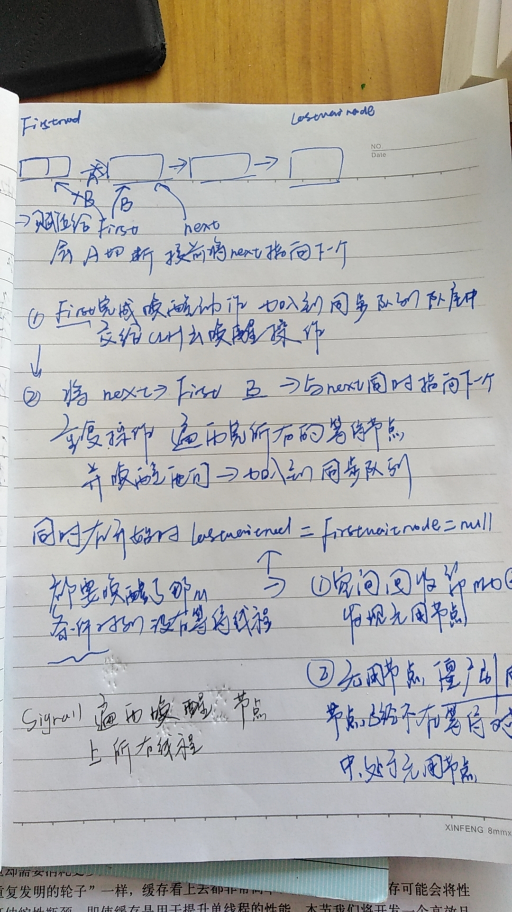

## AbstractQueuedSynchronizer.ConditionObject.doSignalAll() 源码解读

   ### lastWaiter = firstWaiter = null; 这是为什么
    
         AbstractQueuedSynchronizer.ConditionObject 的 doSignalAll 方法用于唤醒等待队列上的所有线程。
         在这个方法开始时，它首先将 lastWaiter 和 firstWaiter 设置为 null。
         这样做的原因是：在唤醒等待队列上的所有线程后，理应不再有任何等待线程，即等待队列应当为空。
        在这种情况下，等待队列的首尾节点 naturally 应当为 null。
         这是一种常见的设计思想，当清空一个队列或列表时，通常会将其首尾节点设置为null。
          这样做不仅可以防止因为意外访问到 "僵尸" 节点（已不再使用、但还有引用指向它的节点），
          还有利于垃圾回收——如果首尾节点不被设为 null，即使它们已不存在等待队列中，
          但仍然有引用指向它们，这将会阻止垃圾回收器回收这些节点占用的内存。

* **空间回收** ：当等待队列中的所有线程都被唤醒，即队列中没有任何线程，则将首尾节点设置为null可以帮助垃圾回收器发现这些现在无用的节点对象，回收它们所占用的内存，避免内存泄露。</li>
* **数据一致性**：如果队列为空，但首尾节点引用还指向某个节点，这会导致数据状态不一致。那么，当我们查看队列状态时可能会造成混淆，因为单纯看首尾节点我们会误以为队列中还有元素。</li>
* **防止僵尸引用**：有时候，即使某个节点已经不再等待队列中，如果我们的引用还持有这个已经无用的节点，就回导致这个无用节点不能被垃圾回收，形成了所谓“僵尸引用”，这既占用了内存空间又没有实际用处。</li>

### java.util.concurrent.locks.AbstractQueuedSynchronizer#transferForSignal

    java.util.concurrent.locks.AbstractQueuedSynchronizer#transferForSignal 
    这是AQS中的一个关键方法，主要用于 Condition 实现中，
    以提醒被给定节点标记为取消或不是等待状态的一个线程，
    假设当前状态已经设置表示线程可以运行。
    这个方法的调用必须在调用线程已经完全唤醒等待线程之后调用。

 * 首先，它检查节点(node)的等待状态是否为 CONDITION (Node.CONDITION)，如果是，则尝试使用 CAS（Compare-and-Swap，比较并交换）将其等待状态设置为 0。如果 CAS 失败，表示节点已经被取消或者已经不在等待状态，所以方法返回false。
如果成功地将状态从 CONDITION 改为 0，那么线程就可以被唤醒。然后，**这个节点就会被添加到同步队列的尾部（通过 enq(node)）**。这是因为在 Condition.await() 时，线程已经从同步队列中移除，所以在这里需要重新添加回去。
然后，方法检查这个节点的前驱节点的等待状态：如果前驱节点的等待状态大于 0，表示前驱节点已经取消，或者尝试把前驱节点的等待状态设置为 SIGNAL (Node.SIGNAL) 但失败了，那么就需要唤醒等待线程。这是因为在 AQS 的设计中，一个节点的唤醒依赖于它的前驱节点；如果前驱节点已经取消或者不能成功地设置为 SIGNAL，那么后续节点可能就无法被唤醒。所以在这里需要直接唤醒等待线程。
 * 总的来说，transferForSignal(Node node) 主要用于 Condition 的实现中，它首先将节点的等待状态从 CONDITION 改为 0，然后把**节点添加到同步队列中**，最后根据前驱节点的状态，可能需要唤醒等待线程。

