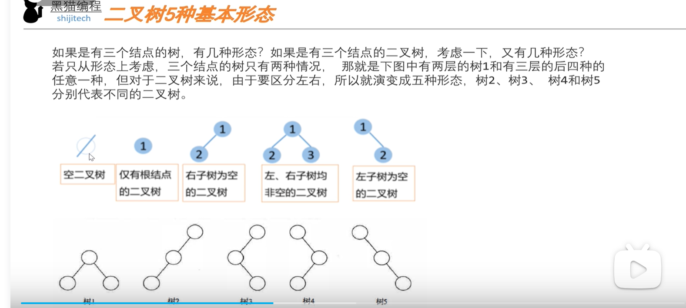

## 最基本的结构概念 由mysql索引结构选型儿引发的存储结构的选型
 ### 我们先学习 他们所有的基础   二叉树
  * **定义**
    * 在学习二叉树之前 我们来了解**树的定义**
      * 有**层次关系**的N（N>=0）个**节点**的**有限集合**
    * 二叉树是一个**有限的节点集合**，这个集合或者为空集（即，是一棵空树）
    * 由**一个根节点**和**两棵互不相交**的、分别称为**左子树**和**右子树**的二叉树组成。 **左子树和右子树是有区别的**是 **分左右的**
    * **二叉**意味着**每个节点最多有两个子节点**（就是每一个节点的**度最多是 2**），即**没有子节点**、只有**一个子节点**或者有**两个子节点**。
      *  **树的度** 在树的上下文中，度是指一个节点拥有的子节点的数量
    * 有着**5中基本组成形式**： 
       * 空二叉树
       * 仅有根节点的二叉树
       * 右字数为空的二叉树
       * 左右子树均非空的
       * 左子树为空的
         
  * **数据结构**
    * **数据域（data）**：用于存储节点的值，可以是任意类型的数据，这里以整型（int）为例 可以是 Object。看具体的业务设计。
    * **左子指针（left）**：是一个指向同类型结构的指针，它指向当前节点的左子节点。如果左子节点不存在，则该指针为NULL。
    * **右子指针（right）**：是一个指向同类型结构的指针，它指向当前节点的右子节点。如果右子节点不存在，则该指针为NULL。
  * **特殊的一些树结构**  引出了我们后续各种业务场景下的 **BST AVL 红黑书 B树 B+树** 就是我们的重点
     * **左斜树（Left Skewed Tree）**
         * 左斜树是每个节点都只有左子节点的二叉树。在这种树中，没有任何节点有右子节点。左斜树的形状类似于一个链表，所有的节点都沿着左边延伸。
     * **右斜树（Right Skewed Tree）**
         * 右斜树是每个节点都只有右子节点的二叉树。在这种树中，没有任何节点有左子节点。右斜树的形状类似于一个链表，所有的节点都沿着右边延伸
     * **完全二叉树（Complete Binary Tree）**
         * 完全二叉树是一种特殊的二叉树，其中所有的层都是完全填满的，除了可能的最后一层。在最后一层，所有的节点都尽可能地向左填充。完全二叉树通常用于实现二叉堆。
     * **满二叉树（Full Binary Tree）**
         * 满二叉树是每个节点都有0个或2个子节点的二叉树。在满二叉树中，没有只有一个子节点的节点。满二叉树的所有叶子节点都在同一层级上。
     * **平衡二叉树（Balanced Binary Tree）**
         * 平衡二叉树是**任何节点**的**两个子树的高度**差**不超过1**的二叉树。这种类型的二叉树可以保证操作的最坏情况下的时间复杂度为O(log n)。AVL树是最早的平衡二叉树之一。
         * **树的高度是指**：二叉树的高度是指从根节点到最远叶子节点的最长路径上的节点数。高度可以从**0或1**开始计树
            * **通常会从1** 开始，反应更加直观 :例子：当只有**一个根节点**的时候，**高度是 1**
     * **二叉查找树（Binary Search Tree, BST）**
        * 二叉查找树是一种特殊的二叉树，它支持快速的查找、插入和删除操作。在二叉查找树中，左子树上的所有节点的值都小于其根节点的值，右子树上的所有节点的值都大于其根节点的值。
     * **AVL树** -它的名称来自于发明者 G.M. Adelson-Velsky 和 E.M. Landis 的名字缩写
        * AVL树是一种高度平衡的二叉查找树，其中任何节点的两个子树的高度最多相差1。AVL树通过旋转操作来维持平衡，从而保证查找、插入和删除操作的时间复杂度始终为O(log n)。
     * **红黑树（Red-Black Tree）**
        * 红黑树是一种自平衡的二叉查找树，它在每个节点上增加了一个存储位表示节点的颜色，可以是红或黑。红黑树通过五个关键性质来保持大致的平衡，确保任何操作的最坏时间复杂度为O(log n)。
     * **B树（B-Tree）** **没有所谓的B减树** 那是有的人老是误读 那个表示的 是杠 就是 B树
          B树是一种自平衡的树数据结构，它维护数据排序并允许搜索、顺序访问、插入和删除操作。B树特别适合用于读写相对较大的数据块的系统（如磁盘存储）。B树通过允许每个节点有多个子节点来减少树的高度。
     * **B+树（B+-Tree）**
       * B+树是B树的变种，它具有所有叶子节点相连的链表，使得范围查询变得更加高效。B+树通常用于数据库和文件系统的索引结构。
  * 引出我们后面要学习的 各种二叉树结构
  * 
    

 ### Hash表
  * **基本概念**
      * 是一种使用哈希函数组织数据，以支持快速**插入**、**删除**和**查找**操作的数据结构。它通过将**键（Key）**通过**哈希函数**转换为**数组索引**来访问记录，这个过程称为哈希化。哈希表的基本组成包括一个**数组**和一个**哈希函数**。
  * **数据结构**
    1. **哈希函数**：
       * 哈希函数是哈希表的核心，它将输入的键转换为数组的索引。理想的哈希函数应该易于计算，并且能够将键均匀分布在数组中，以减少冲突。
    2. 数组：
       * 数组是用来存储数据的主要结构。数组的每个槽位（Slot）或称为存储桶（Bucket），可以存储一个或多个键值对（Entry）。
    3. 键值对（Entry）：
       *  在哈希表中，数据通常以键值对的形式存储。键用于标识数据，而值是数据本身。
    4. **冲突解决：当两个键哈希化后得到相同的索引时，会发生冲突。解决冲突的常见方法有两种：**
       * **开放寻址**（Open Addressing）：当发生冲突时，通过某种探测序列（**如线性探测**、**二次探测**、**双重散列**）在数组中寻找另一个空槽位。
          * **线性探测** ：顺序查找表中的下一个空槽位 ThreadLocal 中的 ThreadLocalMap 就是使用的线性探测的方式来解决hash冲突：hash算法计算索引**如果为空**插入。如果有值判断key是否相同 不同->索引加一 相同->将值替换
          * **二次探测** 查找间隔为平方序列的槽位（1, 4, 9, ...）。 
          * **双重散列**（Double Hashing）：使用第二个哈希函数来决定探测的间隔。
       * **链表法（Chaining）**：每个数组槽位存储一个链表的 后面会**提升效率**会转为 **红黑树** ：我们熟知的hashMap就是用的
    * **哈希索引的优点：**
      * **快速的查找速度**：对于**等值**查询，**等值查询** **等值查询** 哈希索引可以提供接近常**数时间的查找性能（O(1)**），因为它直接通过**哈希函数定位数据**。
      * **空间效率**：哈希索引通常比B+树索引更紧凑，因为它们不需要**存储指向子节点的指针**。
      * **简单的实现**：哈希表的数据结构相对简单，实现起来比B+树更直接。
    * **哈希索引的缺点**：
      * **不支持范围查询**：哈希索引不保留数据的顺序，因此它不能有效地支持**范围查询**（如BETWEEN、<、>操作）。
      * **哈希冲突**：当多个键映射到同一个哈希值时，会发生**哈希冲突**，这会**降低索引的效率**。虽然链表法可以解决冲突，但在冲突较多的情况下，**查找性能**会下降。
      * **不支持排序和分组**：由于哈希索引不维护键的顺序，它不能用于ORDER BY或GROUP BY这样的排序和分组操作。
      * **键值分布不均**：如果键值**分布不均匀**，某些槽位可能会过载，而其他槽位则可能很少使用，这会导致性能不均衡。
      * **不支持前缀查找**：哈希索引不支持基**于前缀的查找**，因为即使是小的键值变化也会导致完全不同的哈希值。
      * **只适用于完全匹配查找**：哈希索引**只适用于完全匹配的查询**，对于**模糊查询**或**部分匹配查询**，哈希索引**无法提供性能优势**。
  ### Hash表不支持 范围查询 顺序查找 ->升级 bst（ Binary Search Tree）： 二叉查找树  
  * **基本概念BST**
    * 二叉查找树是一种特殊的二叉树，它满足以下性质：
    * 每个节点包含一个键和一个值。
    * 节点的左子树只包含**键小于**该节点键的节点。
    * 节点的右子树只包含**键大于**该节点键的节点。
    * **左右子树**也必须分别是**二叉查找树**。
  * **数据结构**
    * 二叉查找树由节点组成，每个节点通常包含以下**几个部分** ：
      * 键（Key）：用于在树中定位和排序的唯一标识符。
      * 值（Value）：与键相关联的数据。
      * 左子节点（Left Child）：指向左子树的指针，左子树的所有键都小于当前节点的键。
      * 右子节点（Right Child）：指向右子树的指针，右子树的所有键都大于当前节点的键
  * **优点**
      * 有序性 
  * **缺点** 也就是后续树发展的必要性
      * **性能**依赖于树的**高度**：在最坏的情况下（如插入的键是有序的），二叉查找树可以退化成**一个链表**：专业：**斜树**，导致查找、插入和删除操作的时间复杂度增加到**O(n)**。
###   由于 二叉查找树可能带来的 斜树问题导致不平衡     升级 AVL树
  * **基本概念**
       * 自平衡的二叉查找树，以其发明者**Adelson-Velsky和Landis**的名字命名。它是最早的自平衡二叉查找树之一。
       * VL树的定义是基**于二叉查找树**的，但它增加了一个额外的平衡条件：对于树中的每个节点，其左子树和右子树的高度最多相差1。这个差值称为节点的**平衡因子**，可以是-1、0或1。
  * **数据结构**
       * **键**（Key）：用于在树中定位和排序的唯一标识符。
       * **值**（Value）：与键相关联的数据。
       * **左子节点**（Left Child）：指向左子树的指针。
       * **右子节点**（Right Child）：指向右子树的指针。
       * **平衡因子**（Balance Factor）：左子树高度减去右子树高度的结果。
       * **节点的高度** 
       * 有的AVL树也会包含 **父节点指针**： 简化某些操作，比如旋转和回溯更新平衡因子时不需要递归。
    
  * 花重点来学习 **旋转操作**

### 重点来了 我们先分析下 B树和B+树的区别？ 为什么最后选了B+树作为索引结构
   ·
   #### 我们先来看 B+树
* **基本概念B+树**
  * B+树是一种自平衡的二叉树，它用于快速检索数据。B+树与B树类似，但是B+树的每个节点都有指向数据的指针，而B树的节点只包含数据。B+树的每个节点都有指向其子节点的指针，以及指向其兄弟节点的指针。B+树的每个叶节点都有指向数据的指针，而B树的叶节点只包含数据。B+树的每个节点都有指向其子节点的指针
     * **高效检索**
     * **自平衡**
     * **排好序**
* **mysql  innodb下存储引擎在的 B+树 数据结构**
  * **页（Page）**：InnoDB存储引擎中的B+树节点**存储在磁盘页中**，通常大小为**16KB**。每个**页对应B+树中的一个节点**。
     * 在Innodb下 查看 **innodb_page_size** 大小 **show GLOBAL STATUS  like 'innodb_page_size'**  / **show VARIABLES   like 'innodb_page_size';**
     * **InnoDB** 最小物理文件管理单元是Page，一个Page大小为**16KB**，而**文件系统**读写数据的最小单元是IO Block，也叫磁盘簇，大小通常为**4096 Bytes (4KB)*
       * InnoDB 设置页大小 
     * **页** 大小通常 由**磁盘页的大小决定**，这是因为**数据库系统通**常以**页为单位进行磁盘I/O**操作。节点大小决定了节点可以包含的**键和指针的最大数量**。
  * B+树是用来实现表的**聚簇索引**和**二级索引（非聚簇索引）的数据结构** ---->**又被称为 辅助索引**
  * **根节点（Root Node）**：B+树的顶部节点，它可以是非叶子节点，也可以是叶子节点，这取决于树中的数据量。
  * **内部节点（Internal Nodes**）：树中的中间层节点，包含键（keys）和指向子节点的指针（pointers）。内部节点用于**指导搜索操作到达正确**的叶子节点。
      * **键** 起到了 分隔的作用又称为分隔键 ：
      * **分隔键的键值范围** 
        * 非叶子节点中的每个键都**定义**了子节点中**键值的范围**。例如，如果非叶子节点包含**键K1和K2**，那么第一个**子节点包含小于K1的所有键**，第二个子节点包含**大于或等于K1且小于K2**的所有键，以此类推。
      * **子节点的指针（pointers）** 分隔键中间存储的就是 **指向子节点的指针（pointers）**
  * **叶子节点（Leaf Nodes）**：树的底层节点，包含**实际的数据**-> 聚集索引  或**指向数据的指针**-> 非聚集索引（二级索引） 。在聚簇索引中->**叶子节点直接包含了表行的数据**。在二级索引中->**叶子节点包含索引列的值和指向聚簇索引记录的指针**。
    * **双向链表（Doubly Linked List）**：叶子节点通过双向链表相连，这允许前向和后向遍历，特别适合范围查询和顺序访问。
    * **记录（Record）**：在聚簇索引的**叶子节点中**，记录是实际的表行数据。在**二级索引**中，记录包含**索引列的值**和**指向**聚簇索引记录(主键值)的指针。
  * **分支因子（Branching Factor）**：节点中**键的最大数量**，通常由磁盘页的大小决定。分支因子影响树的宽度和高度。
  * **最小填充因子（Minimum Fill Factor）**：为了维持树的平衡，每个节点（除了根节点和叶子节点）都应该**至少包含一半的键**
    *  重点 重点  在key删除 新增时候 会触发 重新平衡操作 **节点的分裂 合并 借用**。ken值的重新分配操作
  
  

  #### mysql InnoDB 如何设置 页大小 
  * **背景**
    * 在MySQL的InnoDB存储引擎中，页（也称为块）大小是数据库页的大小，通常默认为**16KB**。页大小是InnoDB表空间中单个页的大小，它对I/O操作和索引结构有重要影响。
    * 要设置InnoDB的页大小，你需要在MySQL服务器的配置文件（通常是**my.cnf或my.ini**）中设置innodb_page_size选项。这个设置**必须**在MySQL服务器**初始化数据目录**并创建新实例**之前进行**，因为它会影响整个InnoDB实例的表空间页布局。
  * **步骤：**
    * 停止MySQL服务器。
    * 打开MySQL服务器的配置文件（my.cnf或my.ini）。
    * 在[mysqld]部分添加或修改innodb_page_size选项。例如，要设置页大小为8KB，添加以下行：
`    plaintext
    [mysqld]
    innodb_page_size=8192`
    * 可用的页大小选项通常包括4KB、8KB、16KB（默认值）、32KB和64KB。
    * 保存配置文件的更改。
    * 初始化MySQL数据目录。如果你已经有一个存在的数据库实例，你需要导出所有数据，删除旧的数据目录，然后重新初始化数据目录。这是因为页大小的更改会影响到InnoDB表空间的物理结构。
    * 启动MySQL服务器。
    * 如果你有现有数据，重新导入之前导出的数据。
  * **注意 注意**
    * 请注意，更改页大小是一个破坏性操作，它需要初始化一个全新的MySQL实例。你不能简单地更改一个现有实例的页大小，因为这会导致数据不兼容。因此，这个操作通常**只在新安装的MySQL服务器**上进行，或者在彻底迁移现有数据库到**新实例**时进行。
    * 在考虑更改InnoDB页大小之前，应该仔细评估这样做的优势和风险，因为它可能会对性能和存储效率产生重大影响。