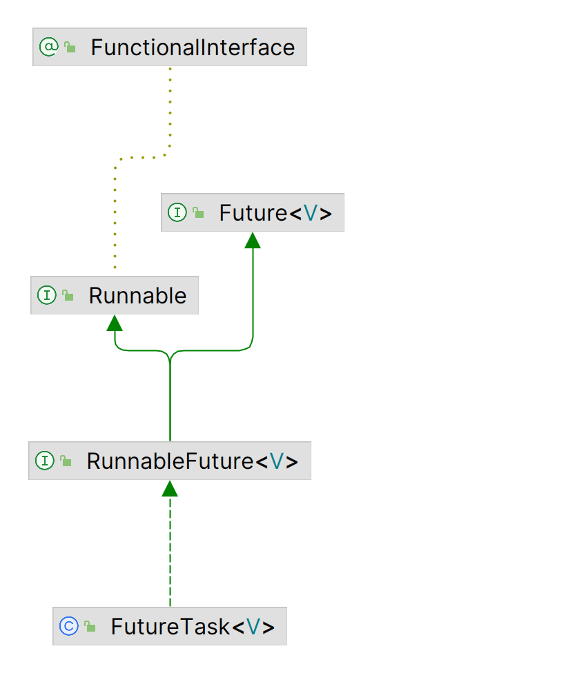

## FutureTask 解析
 ### 基本语义
 * FutureTask 实现了future语义，是一组抽象的可以异步生成结果的计算
 * 
`   future 管理者计算的生命周期。实现Runnable接口
 ### 常用方法
**java.util.concurrent.FutureTask#done**
* FutureTask 类中的一个方法。这个方法在 FutureTask 的 run 任务**正常完成、异常抛出，或者任务被取消之后**被调用。
* 这个 done 方法默认是没有做任何事情的，但是你可以在子类中覆写这个方法以实现特定的行为。比如，你可能会利用这个方法在 Future 完成后发送一个通知，或者释放一些资源。
* 这是一个很有用的特性，因为它允许你在 Future 完成后执行一些清理或者后续处理的操作，而不需要在你的代码中显示地检查 Future 的状态。

**java.util.concurrent.FutureTask#cancel**

* 这个方法的参数 mayInterruptIfRunning 决定了如果这个任务正在运行，是否应该被中断。
**如果传递 true**，那么正在运行的任务将被中断。
**如果传递 false**，那么正在运行的任务将不被中断（但是如果任务还没有开始执行，那么它将不会被执行）。
* 如果任务已经完成，或者已经被取消，或者由于其他原因不能被取消，那么这个方法将会失败并返回 false。如果任务成功被取消，那么这个方法将返回 true。
* 值得注意的是，**取消是一种尝试的操作**，因为任务可能已经完成，或者由于其他原因不可取消。并且即便取消操作成功，也不保证正在运行的任务在接收到中断请求后能立刻停止，这要取决于具体的任务如何处理中断请求。
* 任务取消的内在逻辑是调用任务线程的 **interrupt()** 方法，是去尝试中断线程